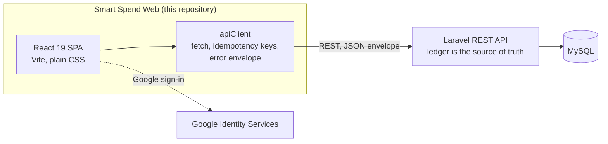

<div align="center">

# Smart Spend — Web

**A smart personal-finance platform: accounts, cash flow, budgets, goals and AI-assisted capture in one place.**

[](https://react.dev)
[](https://vite.dev)
[](https://reactrouter.com)
[_%7C_EN-8A2BE2)](#internationalization-rtl-and-theming)

</div>

---

## Table of contents

- [Overview](#overview)
- [Product vision](#product-vision)
- [Features](#features)
- [Engineering principles](#engineering-principles)
- [Architecture](#architecture)
- [Getting started](#getting-started)
- [Configuration](#configuration)
- [Available scripts](#available-scripts)
- [Project structure](#project-structure)
- [Routing and access control](#routing-and-access-control)
- [Backend API contract](#backend-api-contract)
- [Internationalization, RTL and theming](#internationalization-rtl-and-theming)
- [Documentation](#documentation)
- [Status and roadmap](#status-and-roadmap)
- [Security and privacy](#security-and-privacy)
- [Team](#team)
- [License](#license)

## Overview

Smart Spend helps people see where their money is, how it moves, and which decisions improve their day-to-day finances. Instead of juggling cash, several bank accounts and e-wallets, users keep everything in a single workspace and let the platform handle the ledger, the recurring commitments, the budgets and the reports.

This repository is the **web client**: a single-page application built with React 19 and Vite 8 in plain JavaScript. It is fully bilingual (Arabic with RTL, and English with LTR) with light and dark themes, and it talks to a separate **Laravel REST API** that owns all financial data and logic.

The wider Smart Spend platform is designed as a Web + Mobile ecosystem (React web, React Native mobile) sharing the same Laravel API, with the interface designed in Figma.

## Product vision

Smart Spend is intended to grow into a *Personal & Business Financial Management Platform*: a scalable SaaS product that serves individuals, families, students and small companies.

| Audience | What they need |
| --- | --- |
| Individuals | Salary, cash, wallets, expenses and financial goals in one view |
| Families | Household budgets, shared expenses and periodic obligations |
| Students | University costs, transport, subscriptions and saving plans |
| Small companies | Employee expenses, projects, approvals and reports |

The problems it targets: money scattered across cash, banks and wallets; manual tracking that people forget; no explanation of *why* a balance dropped; fixed expenses that repeat every month; bank statements that never become an organized record; and companies that need approvals, budgets and permissions.

## Features

Everything below is implemented in this repository and backed by the API. Routes are relative to the app root.

| Area | What users can do | Route |
| --- | --- | --- |
| **Dashboard** | Period-filtered overview (today, week, month, quarter, year, all time or a custom range): total balance, income, expenses and net, where money sits by account, cash flow, expense categories, budget progress, savings goals, recurring commitments, recent transactions and a compact financial-alerts card. Multi-currency data is shown per currency, never added together. | `/dashboard` |
| **Accounts** | Create, edit and archive accounts (cash, bank, wallet, savings or custom) and open an account's details. | `/dashboard/accounts` |
| **Financial operations** | Guided capture (choose an account, then an input method, then review) for income and expenses, plus a filterable, paginated ledger. Open any transaction, correct it, or reverse it with a reason. | `/dashboard/financial-operations` |
| **Transfers** | Move money between your own accounts. A transfer is neither income nor expense; an optional fee is booked as a real expense on the source account. Reversing a transfer reverses the movement and the fee together. | `/dashboard/transfers` |
| **Recurring transactions** | Rules for rent, bills, salary and other repeating items, with their occurrences. Confirm or skip the next occurrence, pause, resume or archive a rule. A rule never changes a balance by itself; only a posted occurrence does. | `/dashboard/recurring` |
| **Financial calendar** | A month, week or custom-range calendar that aggregates recurring occurrences, debt due dates, budget period ends and savings-goal target dates. | `/dashboard/calendar` |
| **Statement import** | Wizard that turns a bank statement into transactions: upload, map columns, validate, review (fix or ignore rows), confirm. Imports can be cancelled before confirmation and reversed afterwards, and every import is listed in the history. | `/dashboard/import` |
| **AI expense captures** | Upload a receipt, let the AI read it, then review and confirm what it found. Edit the draft, retry a failed capture or discard it. Nothing is recorded until the user explicitly confirms. | `/dashboard/ai-expense-captures` |
| **Categories** | Built-in system categories (read-only) and custom categories for income and expenses, with archiving. | `/dashboard/categories` |
| **Budgets** | General or per-category spending limits for a period. Usage and status are computed by the backend from real expenses. | `/dashboard/budgets` |
| **Savings goals** | Targets backed by a dedicated savings account. Contribute and withdraw (both are real transfers), pause or resume, and archive once the balance is zero. | `/dashboard/savings-goals` |
| **Debts** | Track money you owe and money owed to you, record payments or collections, reverse them, and see overdue items and a summary. | `/dashboard/debts` |
| **Reports** | Ten read-only report tabs: overview, income and expense, cash flow, accounts, categories, transfers, budgets, savings goals, debts and recurring. Filter by period, currency and grouping. | `/dashboard/reports` |
| **Report exports** | Asynchronous CSV exports of any report with its applied filters, with status tracking, download, cancel and a full export history. | `/dashboard/reports/exports` |
| **Notifications** | A persistent inbox with an unread badge, plus a separate *Financial alerts* tab calculated from current budgets. | `/dashboard/notifications` |
| **Settings** | Edit the profile and change the password. | `/dashboard/settings` |
| **Authentication** | Registration and sign-in for personal and company accounts, Google sign-in, email verification, and a forgot-password flow with a verification code. | `/signin`, `/register`, … |
| **Public site** | Marketing landing page (hero, features, AI, steps, security and a dashboard preview). | `/` |

## Engineering principles

The client is deliberately thin about money. These rules are applied across the codebase:

- **The backend ledger is the source of truth.** Balances, totals, percentages, statuses and due dates are never calculated in the browser. After a write, the affected data is refetched.
- **Exact money handling.** Amounts are sent as four-decimal strings, and sums use BigInt minor units instead of floating-point math. The default display currency is ILS.
- **No double posting.** Money-moving writes carry an `Idempotency-Key`, and one key is kept per logical operation so a retry can never move the money twice.
- **Archive, never delete.** Accounts, categories, budgets, goals and debts are archived and keep their history. Posted transactions and transfers are never edited in place: corrections and cancellations are *reversals* that post compensating entries.
- **Review before posting.** AI captures and statement imports stay drafts until the user confirms them.
- **URL-driven state.** Filters, sort order and pagination live in the URL, so back links and the browser's back button return to the same view.
- **Resilient data loading.** Pages load data with an `AbortController`, ignore aborted requests, and surface errors through a single mapping from API error codes to translated messages.

## Architecture



**Provider tree** (`src/main.jsx`, after the `./i18n` side-effect import):

```
BrowserRouter
└── ThemeProvider
    └── LanguageProvider
        └── AuthProvider
            └── EmailVerificationProvider
                └── App
```

**API layer.** The HTTP client lives in `src/features/Dashboards/User/api/apiClient.js` and exposes `apiRequest(endpoint, { method, query, body, headers, signal, auth, timeoutMs })`. Each backend resource has its own module next to it (`accountsApi`, `transactionsApi`, `budgetsApi`, `importsApi`, and so on) that wraps the client and normalizes payloads.

**Authentication state.** `AuthProvider` owns the session (`ACCESS_TOKEN`, `user`, `workspace`, `ROLE`). It is stored in `localStorage` when "remember me" is on and in `sessionStorage` otherwise, and it is restored on load through `GET /user`. A `401` on an authenticated request clears the session and dispatches the `smartspend:session-expired` event, which logs the user out.

**Workspaces.** Create calls are scoped to a workspace. The workspace is resolved from the dashboard scope and cached in storage.

## Getting started

### Prerequisites

- **Node.js** `^20.19.0`, `^22.13.0` or `>=24` (required by Vite 8 and ESLint 10)
- **npm**
- A running **Smart Spend backend** (Laravel REST API). It is a separate project and is not included in this repository.

### Installation

```bash
git clone https://github.com/money-management-team/smartspend-web.git
cd smartspend-web
npm install
```

### Environment

Create a `.env` file in the project root (see [Configuration](#configuration)):

```bash
VITE_API_BASE_URL=https://your-backend.example.com/api
VITE_GOOGLE_CLIENT_ID=your-google-oauth-web-client-id
```

> **Important:** the dev server has **no proxy**. When the API is on another origin, `VITE_API_BASE_URL` must point at it and the backend must allow your dev origin through CORS.

### Run

```bash
npm run dev
```

Vite prints the local address (by default `http://localhost:5173`).

### Production build

```bash
npm run build      # outputs to dist/
npm run preview    # serves the built bundle locally
```

## Configuration

All variables are read by Vite, must start with `VITE_`, and are embedded in the client bundle, so **never put secrets in them**.

| Variable | Required | Description |
| --- | --- | --- |
| `VITE_API_BASE_URL` | Recommended | Base URL of the backend API. If it is not set, the client falls back to `/api` on the current origin. |
| `VITE_GOOGLE_CLIENT_ID` | For Google sign-in | Google Identity Services web client ID. If it is missing, the Google button is disabled (and a warning is logged in development). |

## Available scripts

| Command | Description |
| --- | --- |
| `npm run dev` | Start the Vite development server with hot reload. |
| `npm run build` | Create an optimized production build in `dist/`. |
| `npm run preview` | Serve the production build locally. |
| `npm run lint` | Run ESLint (flat config with React Hooks and React Refresh rules) over the whole repository. |
| `npx eslint src/path/to/File.jsx` | Lint a single file. |

There is currently no automated test suite.

## Project structure

```
smartspend-web/
├── docs/                          # Feature documentation, one folder per feature
├── public/                        # Static assets
├── src/
│   ├── main.jsx                   # Entry point and providers
│   ├── i18n.jsx                   # i18next setup (ar / en)
│   ├── index.css                  # Design tokens and global styles
│   ├── components/                # Shared components (Loading)
│   ├── contexts/                  # auth, emailVerification, language, notifications, theme
│   ├── layouts/                   # PublicLayout, AuthLayout, DashboardLayout
│   ├── locales/                   # en/en.json, ar/ar.json
│   ├── routes/                    # Path.js, Routes.jsx, Router.jsx, RouteGuards.jsx
│   └── features/
│       ├── PublicPage/            # Landing page and 404
│       ├── Auth/                  # Sign-in, registration and password flows
│       └── Dashboards/User/
│           ├── api/               # apiClient and one module per backend resource
│           ├── utils/             # Money and date formatters
│           ├── Dashboard/  Accounts/  FinancialOperations/  Transfers/
│           ├── Recurring/  Calendar/  Import/  AiExpenseCaptures/
│           ├── Categories/  Budgets/  SavingsGoals/  Debts/
│           ├── Reports/  ReportExports/  Notifications/  Settings/
│           └── AIAssistant/
├── index.html
├── eslint.config.js
└── vite.config.js
```

Conventions: pages live in `src/features/<Area>/<Page>/<Page>.jsx` with a co-located `.css` file, and sub-components in `components/<Name>/<Name>.jsx` with their own `.css`. Detail pages sit next to their list pages (for example `Accounts` and `AccountDetails`).

## Routing and access control

- `src/routes/Routes.jsx` defines four route groups, merged by `Router.jsx` through `useRoutes`:
  - **Public**: the landing page and the catch-all 404, inside `PublicLayout`.
  - **Guest-only**: sign-in, registration and password flows, behind `GuestOnly` and inside `AuthLayout`.
  - **Email-link**: pages opened from emails (reset password, verify email), which work whether or not the user is signed in.
  - **User**: everything under `/dashboard/*`, behind `RequireAuth` and inside `DashboardLayout`.
- Route guards show the loading screen while the session is being restored.
- All URLs are constants in `src/routes/Path.js` (`PATH.AUTH.*`, `PATH.USER.*`) together with path builders such as `getAccountDetailsPath(id)`. Use them instead of hard-coded strings.
- Calendar events and notifications carry a reference (`subject_type` and `subject_id`) rather than a URL; `getSubjectPath` maps it to the matching page.

## Backend API contract

The client expects every response in this envelope:

```json
{ "status": true, "data": {}, "message": "", "errors": {} }
```

A non-OK response, `status !== true`, or an unparseable body is raised as an `ApiError` with one of these codes:

| Code | Meaning |
| --- | --- |
| `NETWORK_ERROR`, `TIMEOUT` | The request did not complete |
| `UNAUTHENTICATED` | Session missing or expired (`401`) |
| `FORBIDDEN`, `NOT_FOUND` | No permission, or not available (`403`, `404`) |
| `CONFLICT` | State conflict, such as an idempotency clash (`409`) |
| `VALIDATION_ERROR` | Field errors, available in `error.errors` |
| `RATE_LIMITED`, `SERVER_ERROR` | Throttled or failed on the server |
| `MALFORMED_RESPONSE`, `WORKSPACE_UNAVAILABLE` | Unexpected payload, or no workspace could be resolved |

Every request sends an `Accept-Language` header taken from the stored interface language (Arabic when nothing is stored). User-facing messages come from `getApiErrorMessage(error, t)`, which maps codes to the `api.errors.*` translation keys.

## Internationalization, RTL and theming

- **Languages:** Arabic (`ar`) and English (`en`), with English as the fallback. Strings live in `src/locales/en/en.json` and `src/locales/ar/ar.json` under the sections `common`, `api`, `auth`, `dashboard` and `home`. Every new key must be added to **both** files.
- **Direction:** changing the language updates `<html lang>` and `<html dir>`. The UI uses logical CSS properties (`inset-inline-*`, `margin-inline`, `padding-inline`), adds `[dir="rtl"]` overrides where needed, and wraps LTR numbers and amounts in `<bdi>` inside RTL text.
- **Theming:** light and dark themes through design tokens on `:root`, with dark overrides under `:root[data-theme="dark"]`. The choice is persisted in `localStorage`.
- **Styling:** plain global CSS (no Tailwind or CSS modules) with BEM-style, component-prefixed class names. Fonts are Tajawal for headings and large financial values, and Cairo for the interface. Animations honor `prefers-reduced-motion`.

## Documentation

Every feature is documented under [`docs/`](docs), one folder per feature, with focused files such as `overview.md`, `api.md`, `business-rules.md` and `implementation.md`.

| Feature | Start here |
| --- | --- |
| Authentication | [docs/auth/overview.md](docs/auth/overview.md) |
| Dashboard | [docs/dashboard/overview.md](docs/dashboard/overview.md) |
| Accounts | [docs/accounts/overview.md](docs/accounts/overview.md) |
| Transactions | [docs/transactions/overview.md](docs/transactions/overview.md) |
| Transfers | [docs/transfers/overview.md](docs/transfers/overview.md) |
| Recurring transactions | [docs/recurring-transactions/overview.md](docs/recurring-transactions/overview.md) |
| Calendar | [docs/calendar/overview.md](docs/calendar/overview.md) |
| Statement imports | [docs/imports/overview.md](docs/imports/overview.md) |
| AI expense captures | [docs/ai-expense-captures/overview.md](docs/ai-expense-captures/overview.md) |
| Categories | [docs/categories/overview.md](docs/categories/overview.md) |
| Budgets | [docs/budgets/overview.md](docs/budgets/overview.md) |
| Savings goals | [docs/savings-goals/overview.md](docs/savings-goals/overview.md) |
| Debts | [docs/debts/overview.md](docs/debts/overview.md) |
| Reports | [docs/reports/overview.md](docs/reports/overview.md) |
| Report exports | [docs/report-exports/overview.md](docs/report-exports/overview.md) |
| Notifications | [docs/notifications/overview.md](docs/notifications/overview.md) |
| Landing page | [docs/home/overview.md](docs/home/overview.md) |

When you change a feature, update its existing docs rather than adding new ones, and keep them in sync with the code.

## Status and roadmap

The personal-finance experience above is complete in this client. The items below are either partly built or still part of the product vision.

**Partly built**

- **AI assistant** (`/dashboard/ai-assistant`): the chat interface is in place but is not connected to the backend yet.
- **Voice entry**: the recorder interface exists, but speech-to-operation is not wired to the backend; it points users to manual entry instead.
- **Settings, Preferences tab**: placeholder.
- **Receipt upload**: the endpoint contract is based on documented assumptions; see [docs/ai-expense-captures/upload.md](docs/ai-expense-captures/upload.md).

**Planned for the platform**

- **Smart Spend Business**: company workspace with roles and permissions, expense requests and approvals, custody and advances, projects and cost centers, and company budgets. Company accounts can already register and sign in, but they currently land in the personal dashboard.
- **Smart saving plans**: three AI-suggested plans (fast, balanced, comfortable) when a goal is created.
- **Extended reporting**: PDF and Excel export (CSV is available today), saved report templates and scheduled monthly reports.
- **Personal extras**: family accounts, offline mode, monthly close and saved searches.
- **Mobile app**: a React Native client on the same API.

## Security and privacy

- Smart Spend **does not ask for bank passwords or wallet secret numbers**, and it does not execute real financial transfers: balances and movements are records in the user's own ledger.
- The AI never changes balances on its own. Suggestions become transactions only after the user reviews and confirms them.
- Sessions are kept in `localStorage` only when the user chooses "remember me", and in `sessionStorage` otherwise. An expired session is cleared automatically.
- `VITE_*` variables are public by nature (they ship in the bundle). Keep secrets on the backend.

## Team

| Member | Role |
| --- | --- |
| Anas Al-Harazeen | Backend (Laravel), Team Leader |
| Rania Albasyouni | Backend (Laravel) |
| Mostafa Ahel | Backend (Laravel) |
| Abdullah Abu Shamla | Frontend (React and React Native) |
| Hadeel Al Nakhala | Frontend (React) |
| Lina Sakalla | UX/UI (Figma) |
| Rawan Jarada | UX/UI (Figma) |

## License

No license has been specified for this repository yet. Until one is added, all rights are reserved by the authors.
